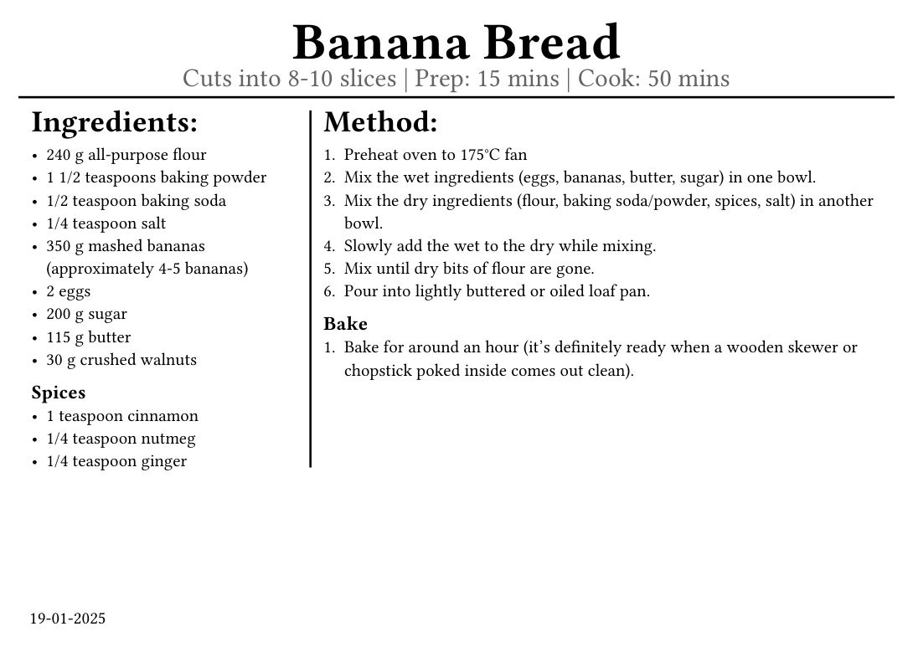

# Banana Blueprint

A Typst template for recipes.



### To print the recipes

1. Export from Typst as a PDF
2. Open the PDF in Acrobat or similar
3. Select A5 paper size
4. Select only the odd pages
5. Select a 1x2 tiling (multiple)
6. Select double-sided printing
7. Print the pages, flip them over and reinsert into the printer
8. Print only the even pages with the same settings
9. Divide the A5 paper in half to create the double-sided A6 recipe cards

Start with

```typst
#show: recipes.with(date: true, blankPages: true)
```

`date` enables the date on the lower left of the page.

`blankPages` adds additional blank pages on even page numbers, see above.

Then add a recipe:

```typst
#recipe(
  title: "Banana Bread",
  details: "Cuts into 8-10 slices | Prep: 15 mins | Cook: 50 mins",
  ingredients: [
    ...
    #section(name: "Spices")[
        ...
    ]
  ],
  method: [
    ...
    #section(name: "Bake")[
      ...
    ]

  ],
)[]
```
